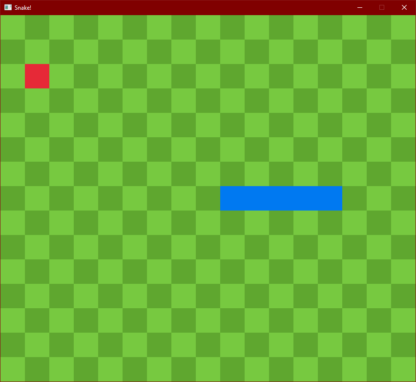

# Snake

## Overview

As a fun challenge for myself as well as a pass-time, I decided to write up this
simple implementation of google snake. It's pretty quaint, if I do say so
myself. This is detailed in legal-ish terms in the license, but you can do
whatever you want with this code. Change it, use it, sell it, whatever. Just
make it clear that it came from here. Enjoy!



## Usage

Compiling and running the game is super easy. Just make sure that cargo is
installed and on path, then run the following command:

```bash
cargo run
```

After that you should be good to go. It should be noted, however, that as of the
last push to the master branch, the only platform on which I have tested this
game is Windows 10, so I'm not sure if it works on Linux or MacOS but Raylib is
cross-platform so it should be ok.

## Contributing

Please, please, please feel free to contribute to this. I know it's not some big
project or anything, but since I'm a student, I'm always looking for feedback on
my work. If you have any suggestions, don't hesitate to create a pull request.